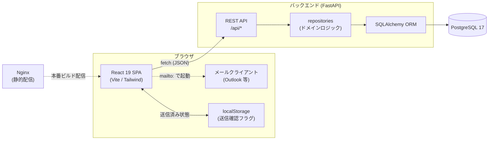
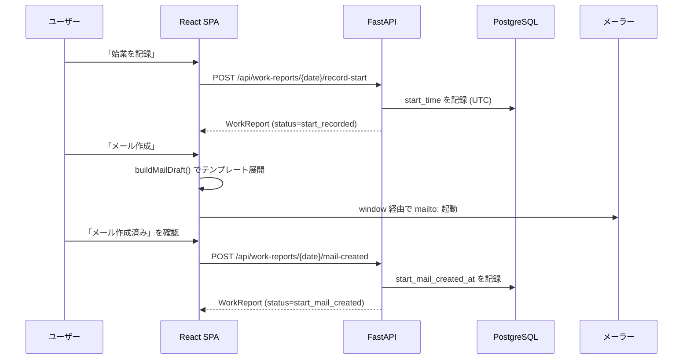

# ARCHITECTURE

laborman は **SPA フロントエンド + REST API バックエンド + PostgreSQL** の 3 層構成です。メール送信機能はサーバー側に持たず、フロントエンドがテンプレートから `mailto:` URL を生成してユーザーのメールクライアントに委譲します。

## システム構成図

## リクエストフロー（始業/終業メール作成）

## レイヤー構成

### バックエンド（`backend/app/`）

| モジュール | 役割 |
|-----------|------|
| `main.py` | FastAPI アプリ生成、CORS ミドルウェア、ルーター登録 |
| `routes.py` | プレゼンテーション層。`/api` 配下のエンドポイント定義と DTO シリアライズ |
| `repositories.py` | アプリケーション／ドメイン層。get-or-create、ステータス導出、勤務時間計算などのロジック |
| `models.py` | インフラ層。SQLAlchemy ORM モデル（`MailSettings` / `WorkReport`） |
| `schemas.py` | Pydantic スキーマ（リクエスト／レスポンス DTO）とテンプレート初期値 |
| `database.py` | エンジン・セッションファクトリ・`get_db` 依存性 |
| `config.py` | `pydantic-settings` による環境変数読み込み（`lru_cache` でシングルトン化） |
| `alembic/` | マイグレーション（モデルとは独立した DDL を保持） |

設計上のポイント:

- **ステータスは保存せず導出する** — `WorkReport` のタイムスタンプ列（`start_time`, `start_mail_created_at`, `end_time`, `end_mail_created_at`）から `derive_status()` が `ReportStatus` を算出します。状態の二重管理を避ける設計です。
- **get-or-create パターン** — 日付指定の参照・更新は対象行が無ければ自動生成（`get_or_create_report`）。フロントは「その日の報告が存在するか」を意識しなくてよい。
- **勤務時間は計算プロパティ** — `work_duration_minutes` はレスポンス時に `end_time - start_time` から算出（保存しない）。
- **時刻は UTC で保存** — 打刻は `datetime.now(UTC)` で記録し、表示整形はフロント側（`date-fns`）が担当。

### フロントエンド（`frontend/src/`）

| パス | 役割 |
|------|------|
| `App.tsx` | 画面状態管理（`today` / `calendar` / `settings` の 3 ビュー切替）と API オーケストレーション |
| `components/TodayReport.tsx` | 本日の打刻・メモ入力・メール作成ボタン |
| `components/ReportCalendar.tsx` | 月次カレンダー（react-day-picker） |
| `components/SettingsPanel.tsx` | メール設定フォーム |
| `components/MailComposeDialog.tsx` | メール下書きプレビューと `mailto:` 起動 |
| `components/ui/` | shadcn-ui 系の共通 UI 部品 |
| `lib/api.ts` | `fetch` ラッパー。全 API 呼び出しを集約 |
| `lib/mail.ts` | テンプレート展開（`renderTemplate`）と `mailto:` URL 構築（`buildMailtoUrl`） |
| `lib/date.ts` | 日付・時刻・勤務時間の整形 |
| `types.ts` | バックエンド DTO に対応する TypeScript 型 |

設計上のポイント:

- **メール送信は行わない** — `lib/mail.ts` が `mailto:` URL を組み立て、件名・本文は `encodeURIComponent` でエスケープ、複数宛先はリテラルのカンマで連結します。送信操作はユーザーのメールクライアントに委譲。
- **テンプレート変数** — `{{date}}` `{{start_time}}` `{{end_time}}` `{{work_duration}}` `{{work_style}}` `{{note}}` を `renderTemplate` が置換。
- **送信確認は localStorage** — 「送信済み」のチェック状態はサーバーに持たず、`laborman.sentConfirmations` キーでブラウザに保持。

## 技術選定の理由（概要）

- **FastAPI + Pydantic**: 型安全な DTO とスキーマ駆動の OpenAPI 自動生成。
- **SQLAlchemy 2.0 + Alembic**: 型付き ORM とマイグレーションの分離。
- **mailto: 方式**: SMTP 認証情報や送信基盤を持たずに既存メール運用へ組み込めるため。
- **Docker Compose**: db / backend / frontend を 1 コマンドで再現。

## デプロイ構成

`docker-compose.yml` に 3 サービス: `db`（PostgreSQL、ヘルスチェック付き）、`backend`（マイグレーション後に uvicorn 起動）、`frontend`（Nginx で静的配信、`VITE_API_BASE_URL` をビルド時引数で注入）。詳細は [SETUP_GUIDE.md](./SETUP_GUIDE.md) を参照。
