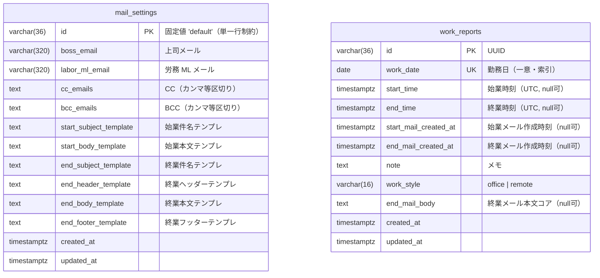

# DATABASE SCHEMA

- **DBMS**: PostgreSQL 17
- **ORM**: SQLAlchemy 2.0（モデル: `backend/app/models.py`）
- **マイグレーション**: Alembic（`backend/alembic/versions/20260606_0001_create_labor_report_tables.py`）

2 テーブルとも独立しており、外部キーによるリレーションはありません（アプリは日付単位で報告を管理し、メール設定は単一行のグローバル設定です）。

## ER 図

## テーブル定義

### mail_settings（メール設定）

アプリ全体で 1 行のみ保持するグローバルなメール設定。`CHECK (id = 'default')` により単一行を強制。

| カラム | 型 | NULL | キー / 既定 | 説明 |
|--------|----|----|------|------|
| `id` | varchar(36) | NOT NULL | PK / `'default'` | 固定主キー |
| `boss_email` | varchar(320) | NOT NULL | `''` | 上司の宛先 |
| `labor_ml_email` | varchar(320) | NOT NULL | `''` | 労務メーリングリスト宛先 |
| `cc_emails` | text | NOT NULL | `''` | CC（複数可、区切り文字でパース） |
| `bcc_emails` | text | NOT NULL | `''` | BCC（複数可） |
| `start_subject_template` | text | NOT NULL | — | 始業メール件名テンプレート |
| `start_body_template` | text | NOT NULL | — | 始業メール本文テンプレート |
| `end_subject_template` | text | NOT NULL | — | 終業メール件名テンプレート |
| `end_header_template` | text | NOT NULL | — | 終業メールヘッダー |
| `end_body_template` | text | NOT NULL | — | 終業メール本文コア |
| `end_footer_template` | text | NOT NULL | — | 終業メールフッター |
| `created_at` | timestamptz | NOT NULL | `now()` | 作成日時 |
| `updated_at` | timestamptz | NOT NULL | `now()` / onupdate | 更新日時 |

制約:

- `PRIMARY KEY (id)`
- `CHECK (id = 'default')` — `ck_mail_settings_single_row`（単一行を保証）

テンプレートで使用可能な変数: `{{date}}`, `{{start_time}}`, `{{end_time}}`, `{{work_duration}}`, `{{work_style}}`, `{{note}}`（展開はフロントエンドの `lib/mail.ts`）。

### work_reports（労務報告）

勤務日ごとに 1 レコード。打刻・メール作成のタイムスタンプを保持し、ステータスはこれらから導出する（DB には保存しない）。

| カラム | 型 | NULL | キー / 既定 | 説明 |
|--------|----|----|------|------|
| `id` | varchar(36) | NOT NULL | PK / UUID | 主キー（`uuid4()`） |
| `work_date` | date | NOT NULL | UNIQUE / index | 勤務日（日付単位で一意） |
| `start_time` | timestamptz | NULL | — | 始業打刻（UTC） |
| `end_time` | timestamptz | NULL | — | 終業打刻（UTC） |
| `start_mail_created_at` | timestamptz | NULL | — | 始業メール作成時刻 |
| `end_mail_created_at` | timestamptz | NULL | — | 終業メール作成時刻 |
| `note` | text | NOT NULL | `''` | メモ（アプリ側で最大 600 文字） |
| `work_style` | varchar(16) | NOT NULL | `'office'` | 勤務区分 |
| `end_mail_body` | text | NULL | — | 終業メール本文コア（作成時に保存） |
| `created_at` | timestamptz | NOT NULL | `now()` | 作成日時 |
| `updated_at` | timestamptz | NOT NULL | `now()` / onupdate | 更新日時 |

制約・インデックス:

- `PRIMARY KEY (id)`
- `UNIQUE (work_date)` — `uq_work_reports_work_date`
- `CHECK (work_style IN ('office', 'remote'))` — `ck_work_reports_work_style`
- `INDEX (work_date)` — `ix_work_reports_work_date`

## 導出値（非永続）

API レスポンス時にコードで算出され、テーブルには列を持ちません（`backend/app/repositories.py`）:

- **`status`**: タイムスタンプ列から `derive_status()` で算出（`not_started` → `start_recorded` → `start_mail_created` → `end_recorded` → `end_mail_created`）。
- **`work_duration_minutes`**: `end_time - start_time` を分換算（いずれか未設定、または負値なら `null`）。
